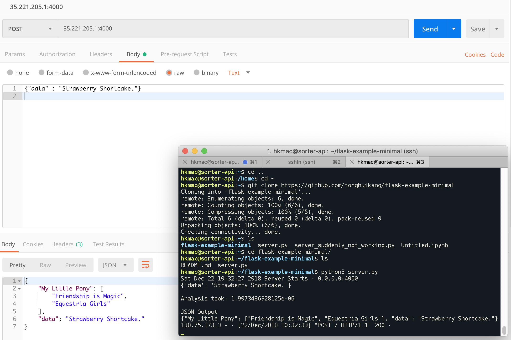

# flask-example-minimal
complete code to receive json object, return json object

I could not find one complete simplest example on the Internet, so I put together one.

Assumes Ubuntu 16.04, 10GB space, allow http and https:
```
curl https://raw.githubusercontent.com/tonghuikang/flask-example-minimal/master/install.sh | sudo bash
```

### Posting
<p align="center"></p>
# sorting
